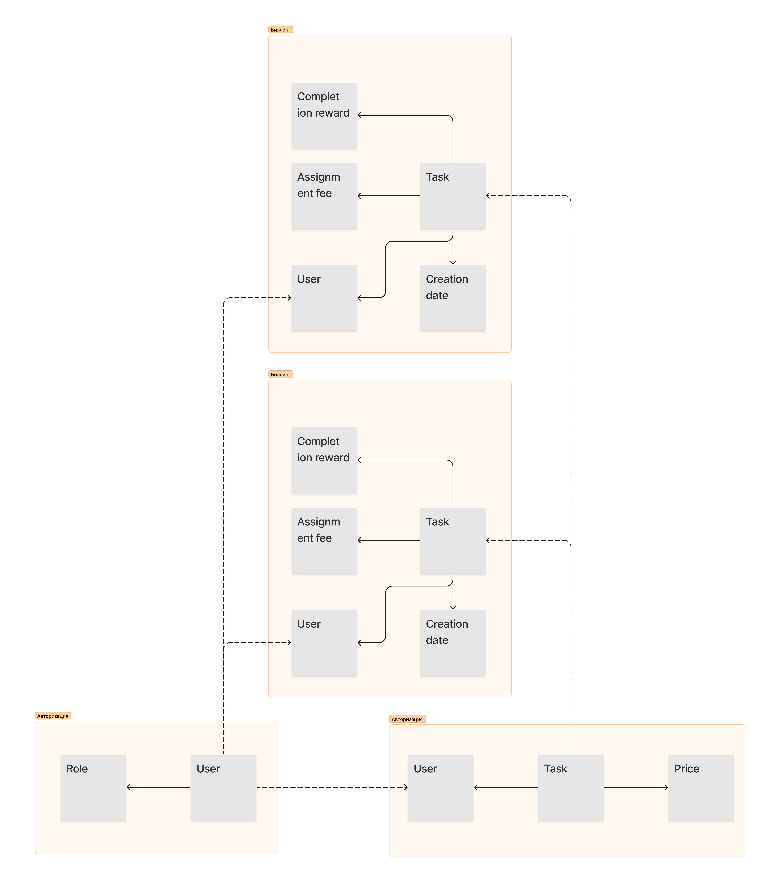
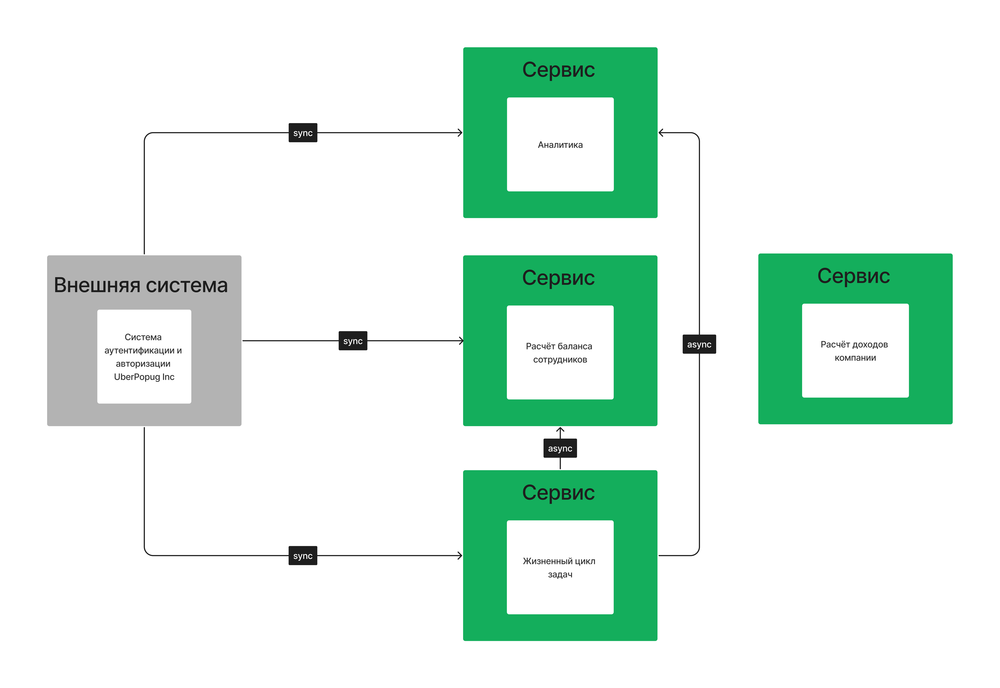

# Event Storming модель системы

## Основные ссылки

* [Figma со всеми схемами](https://www.figma.com/file/iyS53SFu1kTM66hNlWnh5g/week-1?type=whiteboard&node-id=0%3A1&t=895KrVNeUdW1K3GW-1).

## Чеклист

[Требования к системе](requirements.md).

- [x] Разобрать каждое требование на составляющие (актор, команда, событие, query). Определить, как все бизнес цепочки будут выглядеть и на какие шаги они будут разбиваться.
- [x] Построить модель данных для системы и модель доменов.
- [x] Определить, какие общие данные нужны для разных доменов и как связаны данные между разными доменами.
- [x] Разобраться, какие сервисы, кроме таск-трекера, будут в нашей системе и какие между ними могут быть связи.
- [x] Определить все бизнес события, необходимые для работы системы. Отобразить кто из сервисов является продьюсером, а кто консьюмером бизнес событий.
- [x] Выписать все CUD события и какие данные нужны для этих событий, которые необходимы для работы системы. Отобразить кто из сервисов является продьюсером, а кто консьюмером CUD событий.

## Выделенные бизнес-контексты

### Авторизация

Контекст авторизации выделен для обособления внешней системы, с которой будет необходимо интегрироваться всем остальным сервисам.
К нему не предъявляется никаких особых требований кроме доступности, так как работа с ним необходима для доступа ко всем сервисам системы.
Реализацию локальной системы авторизации для увеличения доступности решено считать слишком дорогим.

### Биллинг

Контекст отвечающий за работу с финансовыми данными - другие контексты имеют право инициировать финансовые операции, но их разрешение (списание/начисление средств)
изолировано в контексте биллинга. Выделен из-за особой роли финансовых данных в системе, обособленных бизнес-терминов и специфических требований: контексту неважна доступность, но критична 
консистентность данных.

### Создание задач

Центральный бизнес-контекст системы, отвечающий за её основную функцию. С высокой вероятностью будет развиваться изолированно от других контекстов и изменения будут происходить чаще.

### Аналитика

Вспомогательный контекст для получения дополнительных данных о системе. Определено, что аналитика будет предоставляться на уровне best effort - данные должны быть относительно точными, но
идеальная консистентность неважна. Требования к доступности также низкие.

## Построение архитектуры системы 

### Бизнес-процессы и события в системе

На основе бизнес-контекстов были выделены команды и события, приведённые на event storming диаграмме ниже. 
Домен аналитики не включён на диаграмму, так как используется только для визуализации данных.

### Модель данных

Из event-storming диаграммы и бизнес-требований была определена следующая модель данных.

## Сервисы в системе

- **Система аутентификации и авторизации** - условно определена как внешняя система, отвечающая за передачу данных о пользователях другим сервисам.
                                             При логине пользователи получают токен, который валидируется другими сервисами через внешнюю систему для обеспечения доступа.
- **Сервис менеджмента задач** - отвечает за весь жизненный цикл задачи в системе и отображение соответствующей информации на фронтенде.
- **Сервис биллинга** - отвечает за начисление и списание средств клиентам и компании. Не отвечает за подсчёт баланса в конце дня, только за текущий баланс.
- **Крон биллинга** - производит расчёт баланса в конце дня (сами выплаты происходят вручную) и отправляет уведомления сотрудникам.
- **Сервис аналитики** - производит агрегации финансовых данных для вывода аналитических данных.

❗ **Поскольку данные о задаче нужны сразу в трёх доменах, события об создании и изменении статуса заявки или исполнителя входят в разряд CUD событий**.
Эти события создаются сервисом менеджмента задач и потребляются сервисами биллинга и аналитики. Чтение событий производится асинхронно, через очередь сообщений.

