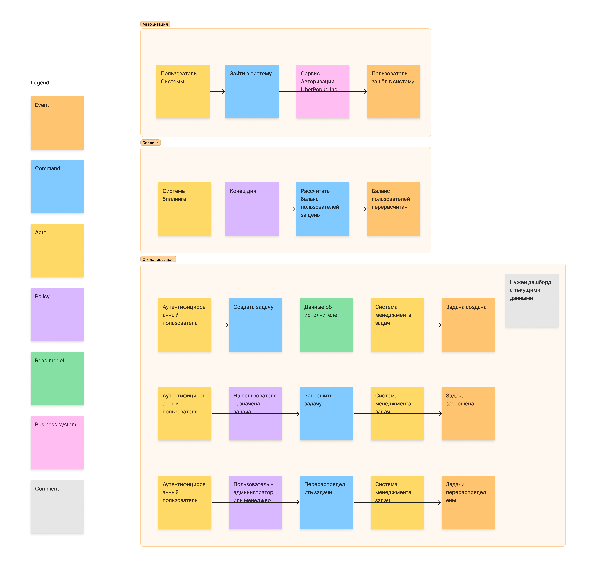

# Event Storming модель системы

## Основные ссылки

## Чеклист

[Требования к системе](requirements.md).

- [ ] Разобрать каждое требование на составляющие (актор, команда, событие, query). Определить, как все бизнес цепочки будут выглядеть и на какие шаги они будут разбиваться.
- [ ] Построить модель данных для системы и модель доменов.
- [ ] Определить, какие общие данные нужны для разных доменов и как связаны данные между разными доменами.
- [ ] Разобраться, какие сервисы, кроме таск-трекера, будут в нашей системе и какие между ними могут быть связи.
- [ ] Определить все бизнес события, необходимые для работы системы. Отобразить кто из сервисов является продьюсером, а кто консьюмером бизнес событий.
- [ ] Выписать все CUD события и какие данные нужны для этих событий, которые необходимы для работы системы. Отобразить кто из сервисов является продьюсером, а кто консьюмером CUD событий.

## Выделенные бизнес-контексты

### Авторизация

Контекст авторизации выделен для обособления внешней системы, с которой будет необходимо интегрироваться всем остальным сервисам.
К нему не предъявляется никаких особых требований кроме доступности, так как работа с ним необходима для доступа ко всем сервисам системы.
Реализацию локальной системы авторизации для увеличения доступности решено считать слишком дорогим.

### Биллинг

Контекст отвечающий за работу с финансовыми данными - другие контексты имеют право инициировать финансовые операции, но их разрешение (списание/начисление средств)
изолировано в контексте биллинга. Выделен из-за особой роли финансовых данных в системе, обособленных бизнес-терминов и специфических требований: контексту неважна доступность, но критична 
консистентность данных.

### Создание задач

Центральный бизнес-контекст системы, отвечающий за её основную функцию. С высокой вероятностью будет развиваться изолированно от других контекстов и изменения будут происходить чаще.

### Аналитика

Вспомогательный контекст для получения дополнительных данных о системе. Определено, что аналитика будет предоставляться на уровне best effort - данные должны быть относительно точными, но
идеальная консистентность неважна. Требования к доступности также низкие.

## Бизнес-процессы и события в системе

На основе бизнес-контекстов были выделены следующие команды и события. Домен аналитики не включён на диаграмму, так как используется лишь для визуализации данных.

## Модель данных

## Сервисы в системе

### События
